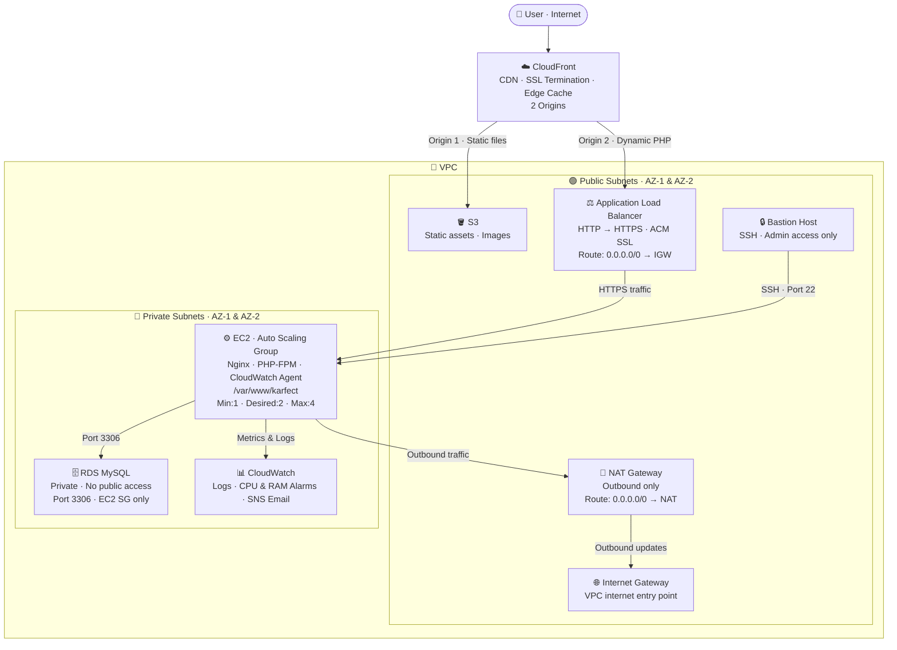

# Karfect — AWS Production Deployment

> A full-stack PHP/Laravel web application deployed on AWS with high availability, auto scaling, CDN delivery, private networking, and centralized monitoring — built to production standards.


---

## Table of Contents

- [Architecture Overview](#architecture-overview)
- [AWS Services Used](#aws-services-used)
- [How I Built This](#how-i-built-this--step-by-step)
- [Infrastructure Breakdown](#infrastructure-breakdown)
- [Security Design](#security-design)
- [Deployment Flow](#deployment-flow)
- [Key Learnings](#key-learnings)

---

## Architecture Overview

The deployment separates compute, database, and static assets across distinct AWS services — each placed in its correct network tier. CloudFront sits at the edge with **two origins**: S3 for static files and ALB for dynamic PHP traffic. All EC2 instances and the RDS database live in private subnets — completely isolated from direct internet access.



---

## AWS Services Used

| Service | Purpose |
|---|---|
| **EC2** | Application server — Nginx + PHP-FPM |
| **Auto Scaling Group** | Horizontal scaling based on CPU utilization |
| **Application Load Balancer** | HTTPS traffic distribution across EC2 instances |
| **RDS (MySQL)** | Managed relational database in private subnet |
| **S3** | Static file and image storage |
| **CloudFront** | CDN with dual origins — S3 and ALB |
| **VPC** | Custom isolated network with public + private tiers |
| **Internet Gateway** | Internet access entry point for the VPC |
| **NAT Gateway** | Outbound-only internet access for private subnet resources |
| **CloudWatch** | Log streaming, metric monitoring, and alerting |
| **SNS** | Email notifications for CloudWatch alarms |
| **ACM** | SSL/TLS certificate for HTTPS on ALB |
| **AMI** | Immutable server snapshot for consistent EC2 provisioning |
| **IAM** | Least-privilege roles and policies for EC2 and services |

---

## How I Built This — Step by Step

### Step 1 — Set up a base EC2 instance and deploy the application

Launched a public EC2 instance and installed the full application stack:

```bash
# Web server and PHP
sudo apt install nginx php-fpm php-mysql php-mbstring php-xml -y

# Composer for Laravel dependencies
curl -sS https://getcomposer.org/installer | php
sudo mv composer.phar /usr/local/bin/composer

# Deploy application
sudo cp -r karfect/ /var/www/karfect
sudo chown -R www-data:www-data /var/www/karfect
```

Configured Nginx server block in `/etc/nginx/sites-available/karfect`, enabled it via symlink to `sites-enabled`, and verified the app was serving correctly.

---

### Step 2 — Designed the VPC with proper subnet separation

Created a custom VPC with two tiers across two Availability Zones:

- **Public subnets (AZ-1 & AZ-2)** — ALB, Bastion Host, NAT Gateway
- **Private subnets (AZ-1 & AZ-2)** — EC2 instances, RDS

Configured route tables:

| Subnet | Destination | Target |
|---|---|---|
| Public | `0.0.0.0/0` | Internet Gateway |
| Private | `0.0.0.0/0` | NAT Gateway |

The Internet Gateway allows inbound and outbound internet traffic for public subnet resources. The NAT Gateway allows private subnet resources (EC2, RDS) to make outbound requests (package updates, CloudWatch logs) without being reachable from the internet.

---

### Step 3 — Provisioned RDS in the private subnet

Launched a MySQL RDS instance inside the private subnet with public accessibility **disabled**. Created a dedicated Security Group allowing inbound port 3306 only from the EC2 Security Group.

Connected via the bastion host, imported the Karfect database, and updated Laravel `.env`:

```env
DB_CONNECTION=mysql
DB_HOST=karfect-db.xxxxxxx.rds.amazonaws.com
DB_PORT=3306
DB_DATABASE=karfect
DB_USERNAME=admin
DB_PASSWORD=*****
```

---

### Step 4 — Moved static assets to S3 and configured CloudFront with dual origins

Uploaded all images and static files to S3. Created a CloudFront distribution with two origins:

| Origin | Source | Behavior |
|---|---|---|
| Origin 1 | S3 bucket | `/images/*`, `/static/*`, `/css/*`, `/js/*` |
| Origin 2 | Application Load Balancer | All other requests (`/*`) |

Static files are cached and delivered from the nearest AWS edge location. Dynamic PHP requests are forwarded to the ALB. Updated Laravel config to reference CloudFront URLs for all asset delivery.

---

### Step 5 — Tested everything end-to-end, then created an AMI

Verified all application functionality — page loads, database reads/writes, image delivery via CloudFront, HTTPS. Once confirmed working, created a custom **AMI** (Amazon Machine Image) from the EC2 instance.

This AMI captures the exact server state: OS, installed packages, application code, Nginx config, PHP config, CloudWatch agent setup. Every EC2 instance launched by the Auto Scaling Group starts from this known, tested state.

---

### Step 6 — Built the Auto Scaling Group via Launch Template

Created a **Launch Template** referencing the AMI with instance type, Security Group, key pair, and IAM instance profile.

Configured the **Auto Scaling Group**:

```
Min capacity  : 1
Desired       : 2
Max capacity  : 4
Scaling policy: Target tracking — CPU utilization at 60%
Health check  : ELB (ALB health checks)
```

New instances automatically register with the ALB Target Group on launch and deregister cleanly on termination.

---

### Step 7 — Configured ALB with HTTPS and SSL certificate

Created the Application Load Balancer in the public subnets. Configured listeners:

- **Port 80 (HTTP)** → Redirect to HTTPS (301)
- **Port 443 (HTTPS)** → Forward to Target Group (ACM certificate attached)

The ALB performs health checks on `/` for each EC2 instance and routes traffic only to healthy targets.

---

### Step 8 — Installed CloudWatch Agent and configured alarms

Installed CloudWatch Agent on EC2 instances to stream logs remotely:

```bash
sudo /opt/aws/amazon-cloudwatch-agent/bin/amazon-cloudwatch-agent-ctl \
    -a fetch-config -m ec2 -s \
    -c ssm:/AmazonCloudWatch-Config
```

**Log Groups created:**
- `/karfect/nginx/access`
- `/karfect/nginx/error`
- `/karfect/system`

**Alarms configured:**

| Alarm | Threshold | Action |
|---|---|---|
| CPU utilization | > 70% for 2 periods | SNS → Email notification |
| Memory utilization | > 80% for 2 periods | SNS → Email notification |

Full log access and alerting without needing to SSH into any instance.

---

## Infrastructure Breakdown

### Networking

- Custom VPC with dedicated CIDR block
- 2 public subnets across AZ-1 and AZ-2
- 2 private subnets across AZ-1 and AZ-2
- Internet Gateway attached to VPC
- NAT Gateway in public subnet for private outbound traffic
- Separate route tables for public and private tiers

### Compute

- EC2 with Nginx, PHP-FPM, MySQL client, Composer
- Application deployed to `/var/www/karfect`
- Custom AMI → Launch Template → Auto Scaling Group
- ASG scaling policy: CPU target tracking at 60%
- Health checks performed by ALB on each instance

### Database

- RDS MySQL in private subnet
- No public endpoint — accessible only within VPC
- Security Group: inbound port 3306 from EC2 Security Group only
- Automated backups enabled

### CDN and Static Assets

- S3 bucket for all static files and images
- CloudFront distribution with two cache behaviors
- Origin 1: S3 (static content — long TTL cache)
- Origin 2: ALB (dynamic PHP — short TTL or no cache)

### Monitoring

- CloudWatch Agent streaming Nginx and system logs
- Custom metric alarms for CPU and memory
- SNS topic with email subscription for alert delivery
- All logs accessible remotely — no SSH required for observation

---

## Security Design

Every resource follows the **principle of least privilege** — no component is directly reachable unless it absolutely must be.

| Resource | Protocol | Port | Source | Notes |
|---|---|---|---|---|
| ALB | HTTP/HTTPS | 80, 443 | `0.0.0.0/0` | Public-facing, only entry point |
| EC2 | HTTP | 80 | ALB SG only | No direct public access to instances |
| EC2 | SSH | 22 | Bastion SG only | SSH locked to bastion host |
| Bastion Host | SSH | 22 | Admin IP only | Single controlled SSH entry |
| RDS MySQL | MySQL | 3306 | EC2 SG only | Private subnet, no public endpoint |
| S3 | HTTPS | 443 | CloudFront OAI | Direct S3 access blocked |

**Security group chain:**
```
Internet → ALB SG → EC2 SG → RDS SG
```
Each layer only accepts traffic from the layer directly above it.

---

## Deployment Flow

```
Base EC2 (nginx + php-fpm + app deployed + .env configured)
    │
    ├── Connected to RDS (via bastion) → DB imported
    ├── Static assets → S3 → CloudFront Origin 1
    └── App tested end-to-end ✓
         │
         ▼
    AMI created from working EC2
         │
         ▼
    Launch Template (AMI + SG + IAM + instance type)
         │
         ▼
    Auto Scaling Group (min:1 · desired:2 · max:4 · CPU policy)
         │
         ▼
    Target Group (health check: /) ← ALB (HTTPS · ACM · HTTP redirect)
         │
         ▼
    CloudFront Origin 2 → ALB → ASG instances → RDS
         │
         ▼
    CloudWatch Agent → Log Groups → Alarms → SNS → Email
```

---

## Key Learnings

- **Network tier separation matters first** — deciding what is public vs private before touching any service prevents security mistakes that are painful to fix later.

- **NAT Gateway is the key to private subnet outbound access** — EC2 instances in private subnets can reach the internet for updates, log delivery, and API calls without being reachable from the internet themselves.

- **CloudFront with two origins is the right pattern for PHP apps with heavy static assets** — it separates caching strategies: static files get long TTL at edge, dynamic routes bypass cache entirely.

- **Always build the AMI from a fully tested instance** — the ASG will launch clones of that instance. If the base is broken, every scaled instance inherits the same break.

- **Security groups chain better than they stack** — chaining ALB SG → EC2 SG → RDS SG means each layer validates its upstream caller, not just a broad IP range.

- **CloudWatch Agent removes the need for SSH-based log access** — in a production setup, no one should be regularly SSHing into instances. Logs and metrics should be observable remotely.

---

## Application Stack

| Layer | Technology |
|---|---|
| Web server | Nginx |
| PHP processor | PHP-FPM |
| Framework | Laravel (PHP) |
| Database | MySQL (AWS RDS) |
| Static delivery | AWS S3 + CloudFront |
| OS | Ubuntu (EC2) |

---

*Built by Sandip — Cloud Infrastructure Project*
